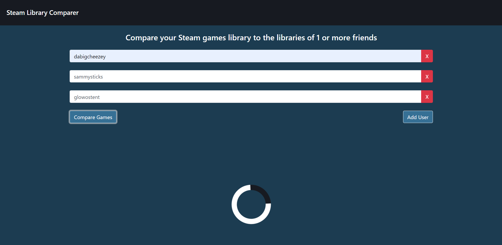
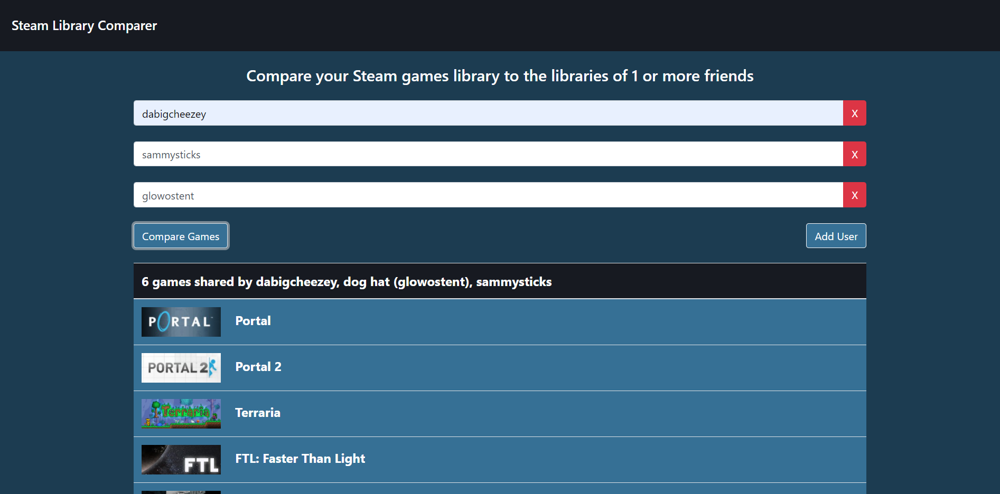

# Games Library Comparison App

## Use
Find out which games are shared within multiple users' libraries. Just type in the vanity URL of up to 10 users to find out what games they share in common. The vanity url is the last part of a user's profile url (e.g. http://steamcommunity.com/id/**"vanity url"**). It is by default the user's Steam ID number, but can be updated in the settings of your Steam profile. Make sure account settings for the profile and it's game library is public. For a tested example try any of these users: sammysticks, dabigcheezey, glowostent.

## Deployed Site
https://comparegameslibrary.herokuapp.com/

## Screenshots
### Home Screen

### Loading

### Shared Games List

## Work In Progress

This app is a work in progress. It's purpose will be to allow gamers, like myself, to compare their games lists with their friends. The MVP will be for Steam only, but I'll work to expand that to other platforms at some point post-MVP. If you'd like to see our current development plans, you can see them in [this markdown file](./current-dev-plans.md). To review the history on what we have already accomplished in the development of this app, you can read through [this file](./dev-history.md).